<a name="readme-top"></a>

[![Contributors][contributors-shield]][contributors-url]
[![Forks][forks-shield]][forks-url]
[![Stargazers][stars-shield]][stars-url]
[![Issues][issues-shield]][issues-url]
[![MIT License][license-shield]][license-url]
[![LinkedIn][linkedin-shield]][linkedin-url]

<!-- PROJECT LOGO -->
<br />
<div align="center">
  <a href="https://github.com/MateuszKrolik/EXPRESS-SHOP">
    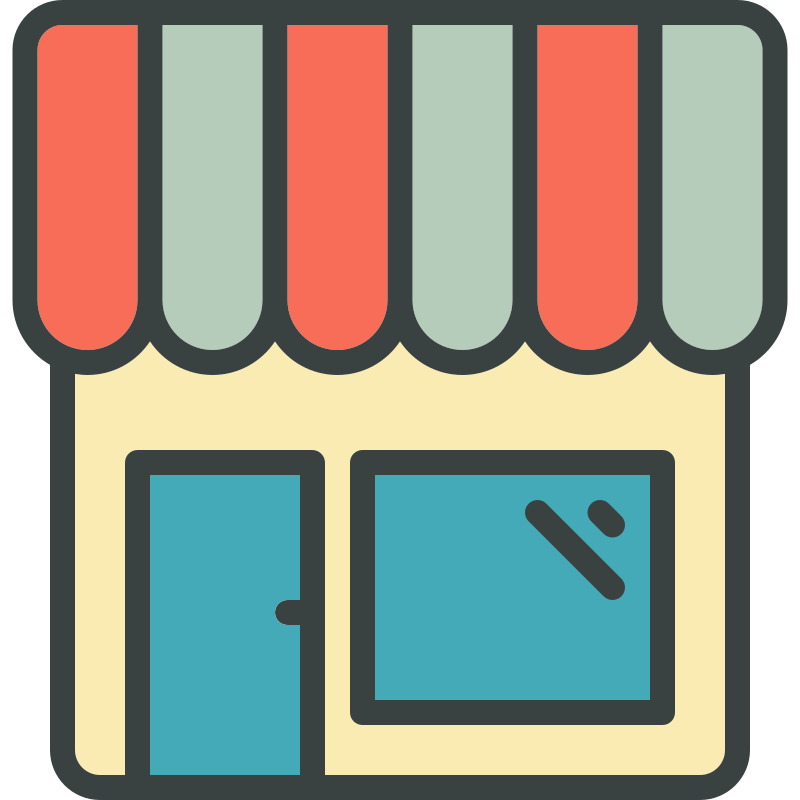
  </a>

<h3 align="center">E-Commerce Shop</h3>
  <p align="center">
    <br />
    <a href="https://github.com/MateuszKrolik/EXPRESS-SHOP"><strong>Explore the docs »</strong></a>
    <br />
    <br />
    <a href="https://github.com/MateuszKrolik/EXPRESS-SHOP">View Demo</a>
    ·
    <a href="https://github.com/MateuszKrolik/EXPRESS-SHOP/issues">Report Bug</a>
    ·
    <a href="https://github.com/MateuszKrolik/EXPRESS-SHOP/issues">Request Feature</a>
  </p>
</div>

<!-- TABLE OF CONTENTS -->
<details>
  <summary>Table of Contents</summary>
  <ol>
    <li>
      <a href="#about-the-project">About The Project</a>
      <ul>
        <li><a href="#built-with">Built With</a></li>
      </ul>
    </li>
    <li>
      <a href="#getting-started">Getting Started</a>
      <ul>
        <li><a href="#prerequisites">Prerequisites</a></li>
        <li><a href="#installation">Installation</a></li>
      </ul>
    </li>
    <li><a href="#usage">Usage</a></li>
    <li><a href="#roadmap">Roadmap</a></li>
    <li><a href="#contributing">Contributing</a></li>
    <li><a href="#license">License</a></li>
    <li><a href="#contact">Contact</a></li>
    <li><a href="#acknowledgments">Acknowledgments</a></li>
  </ol>
</details>

<!-- ABOUT THE PROJECT -->

## About The Project

### Click below image to visit the WebSite 😀

[![Product Name Screen Shot][product-screenshot]](https://mkrolik-shop.ashycoast-2fd8c4d9.germanywestcentral.azurecontainerapps.io/)

### MongoDB Schema Visualization below 😁(Hackolade)


<p align="right">(<a href="#readme-top">back to top</a>)</p>

### Built With

-   [![Express.js][Express.js]][Express-url]
-   [![MongoDB][MongoDB]][MongoDB-url]
-   [![Mongoose][Mongoose]][Mongoose-url]
-   [![EJS][EJS]][EJS-url]
-   [![Docker][Docker]][Docker-url]
-   [![Linux/Unix][Linux/Unix]][Linux/Unix-url]
-   [![Node.js][Node.js]][Node-url]
-   [![JavaScript][JavaScript]][JavaScript-url]
-   [![NPM][NPM]][NPM-url]
-   [![Microsoft Azure][Microsoft Azure]][Azure-url]
-   [![Azure Blob Storage][Azure Blob Storage]][AzureBlob-url]
-   [![Azure Container Apps][Azure Container Apps]][AzureContainerApps-url]
-   [![Stripe][Stripe]][Stripe-url]
-   [![PostMark][PostMark]][PostMark-url]
-   [![HTML5][HTML5]][HTML5-url]
-   [![CSS3][CSS3]][CSS3-url]

<p align="right">(<a href="#readme-top">back to top</a>)</p>

<!-- GETTING STARTED -->

## Getting Started

As a prerequisite i recommend having Node.js and NPM installed, as well as Docker for Desktop.

For a Smooth DataBase managemenent also consider using MongoDB Compass.

### Prerequisites

This is a list of things you need to use the software and how to install them.

-   npm
    ```sh
    npm install npm@latest -g
    ```

### Installation

1. Clone the repo
    ```sh
    git clone https://github.com/MateuszKrolik/EXPRESS-SHOP.git
    ```
2. Install NPM packages
    ```sh
    npm install
    ```
3. Enter your environment variables in `.env` and `nodemon.json`.
    ```js
    POSTMARK_API_KEY = "ENTER YOUR POSTMARK_API_KEY";
    POSTMARK_SENDER_SIGNATURE = "ENTER YOUR POSTMARK_SENDER_SIGNATURE";
    STRIPE_SECRET_KEY = "ENTER YOUR STRIPE_SECRET_KEY";
    MONGO_USER = "ENTER YOUR MONGO_USER";
    MONGO_DEFAULT_DATABASE = "ENTER YOUR MONGO_DEFAULT_DATABASE";
    AZURE_STORAGE_CONNECTION_STRING =
        "ENTER YOUR AZURE_STORAGE_CONNECTION_STRING";
    ```
4. You can pull the Docker image from DockerHub using the following command:
    ```sh
    docker pull mateuszkrolik/shop:latest
    ```

<p align="right">(<a href="#readme-top">back to top</a>)</p>

<!-- USAGE EXAMPLES -->

## Usage

_Below you'll find visual usage example representation if form of screenshots.
To test these out yourself visit this [Link](https://mkrolik-shop.ashycoast-2fd8c4d9.germanywestcentral.azurecontainerapps.io/) 😉_

<div align="center">
  <a href="https://mkrolik-shop.ashycoast-2fd8c4d9.germanywestcentral.azurecontainerapps.io/signup">
    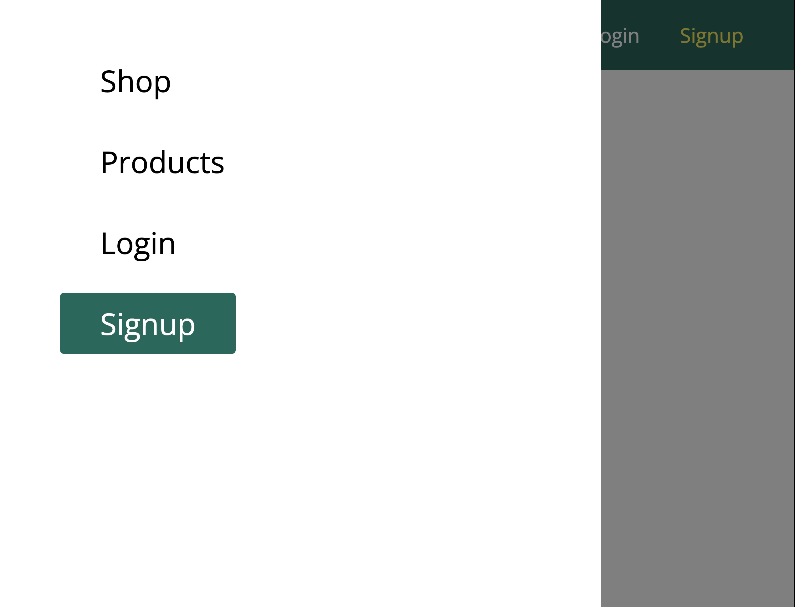
  </a>
  <a href="https://mkrolik-shop.ashycoast-2fd8c4d9.germanywestcentral.azurecontainerapps.io/signup">
    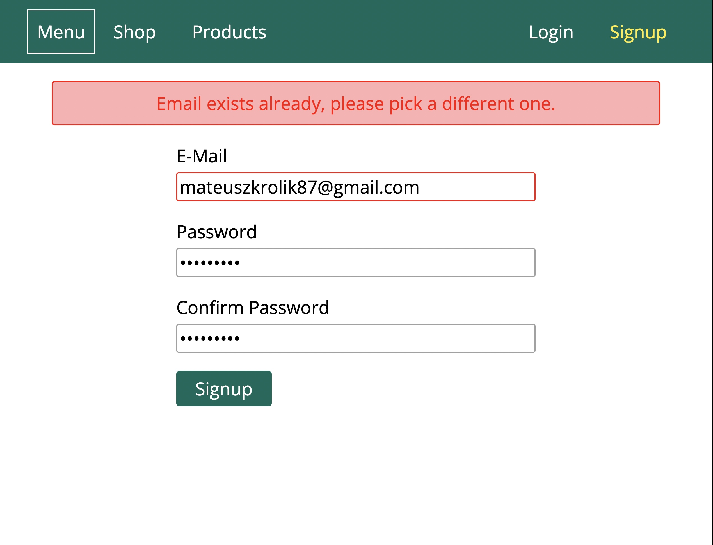
  </a>
  <a href="https://mkrolik-shop.ashycoast-2fd8c4d9.germanywestcentral.azurecontainerapps.io/admin/add-product">
    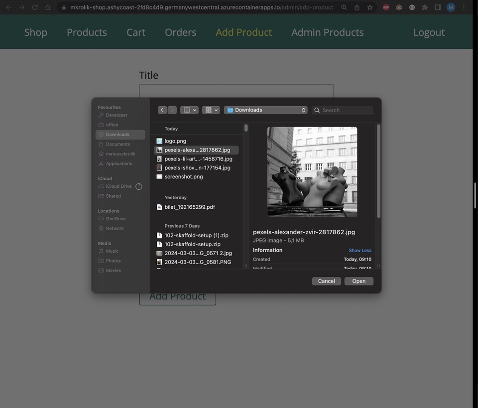
  </a>
  <a href="https://mkrolik-shop.ashycoast-2fd8c4d9.germanywestcentral.azurecontainerapps.io/?page=2">
    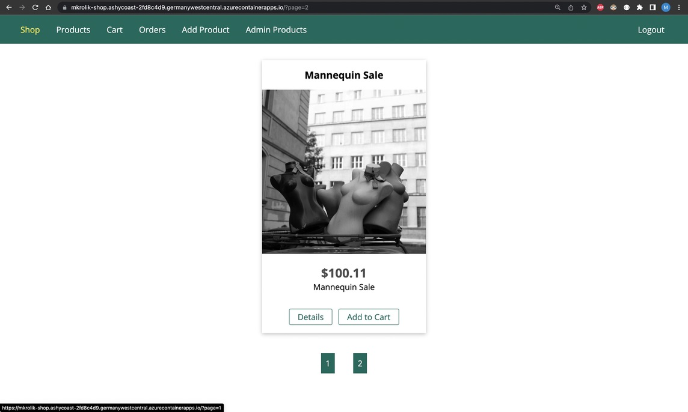
  </a>
  <a href="">
    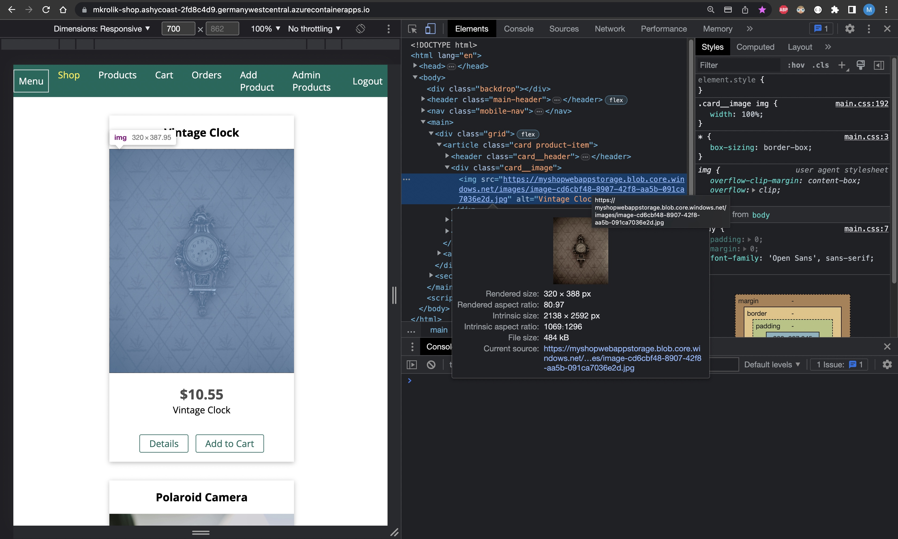
  </a>
  <a href="">
    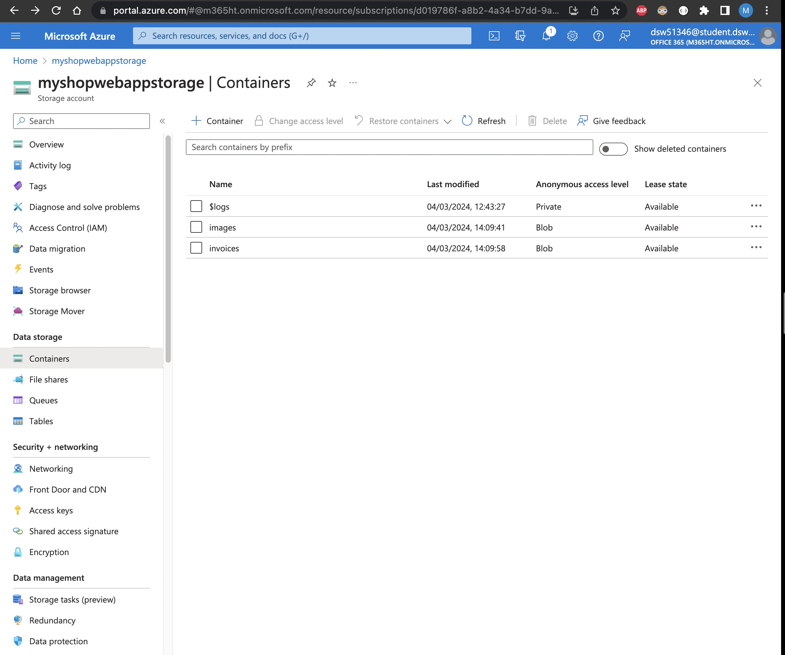
  </a>
  <a href="https://mkrolik-shop.ashycoast-2fd8c4d9.germanywestcentral.azurecontainerapps.io/cart">
    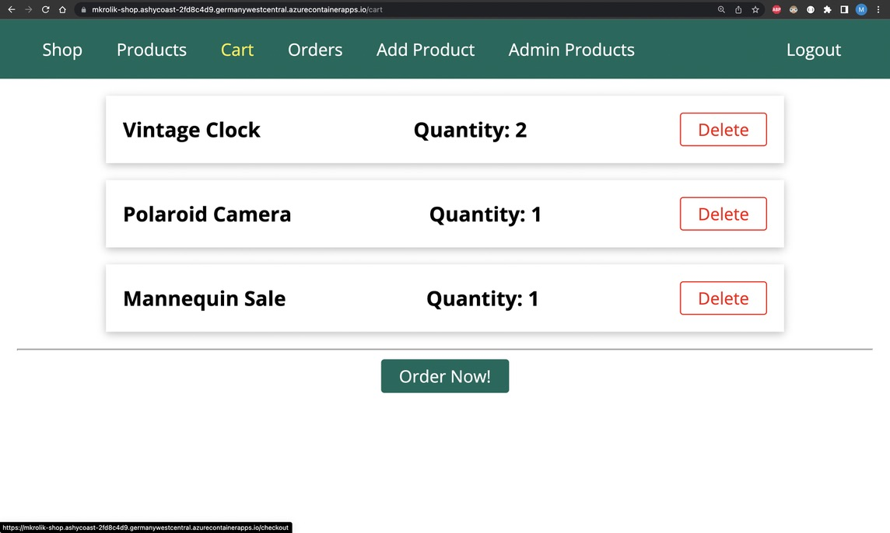
  </a>
  <a href="">
    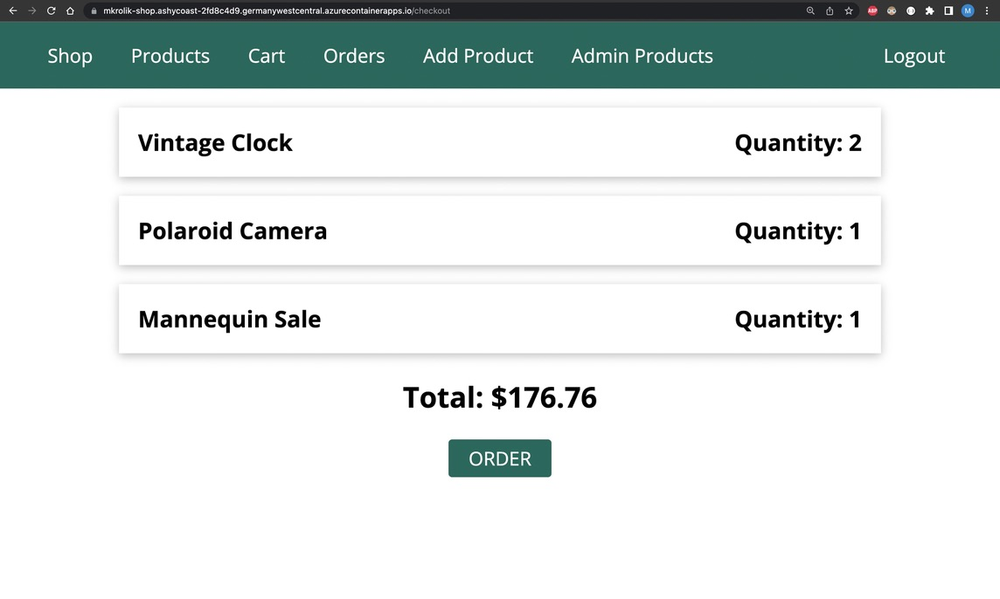
  </a>
  <a href="">
    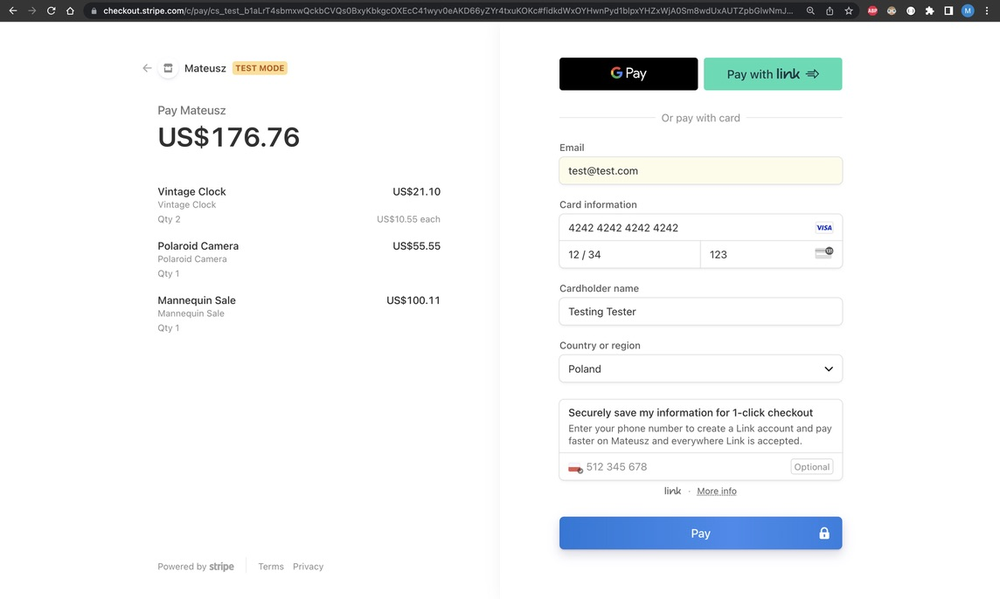
  </a>
  <a href="https://mkrolik-shop.ashycoast-2fd8c4d9.germanywestcentral.azurecontainerapps.io/orders">
    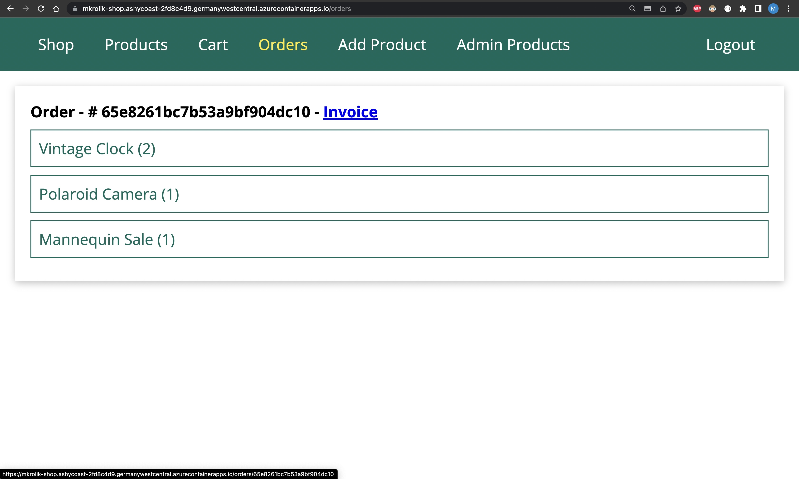
  </a>
  <a href="">
    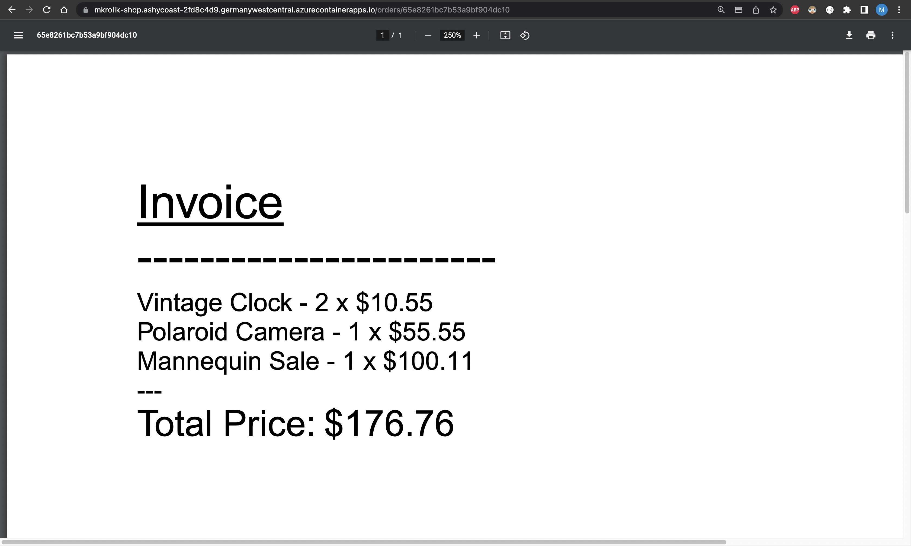
  </a>
  <a href="https://mkrolik-shop.ashycoast-2fd8c4d9.germanywestcentral.azurecontainerapps.io/reset">
    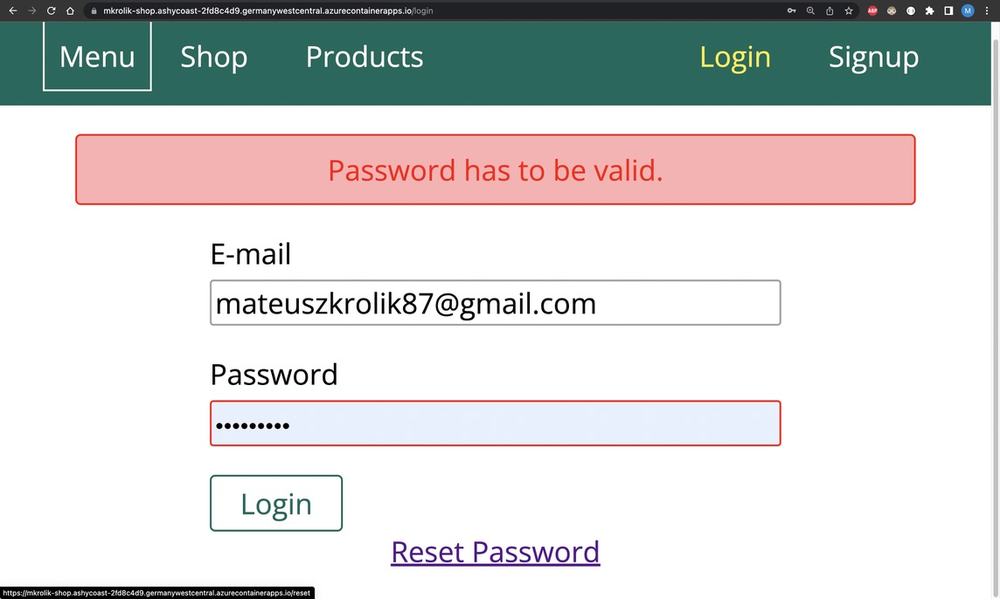
  </a>
  <a href="https://mkrolik-shop.ashycoast-2fd8c4d9.germanywestcentral.azurecontainerapps.io/reset">
    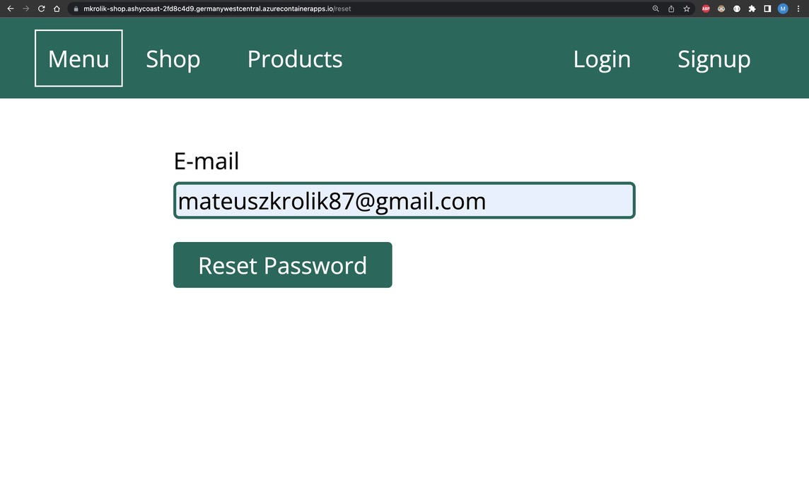
  </a>
  <a href="https://mkrolik-shop.ashycoast-2fd8c4d9.germanywestcentral.azurecontainerapps.io/reset">
    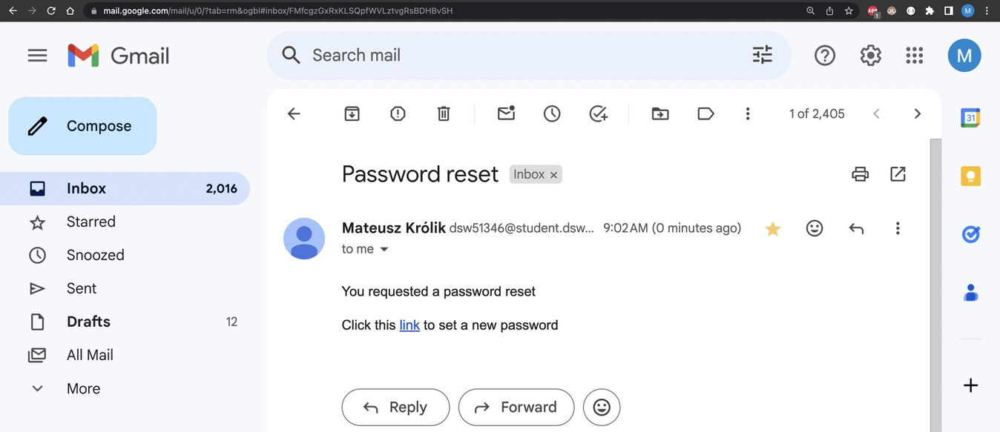
  </a>
  <a href="https://mkrolik-shop.ashycoast-2fd8c4d9.germanywestcentral.azurecontainerapps.io/reset">
    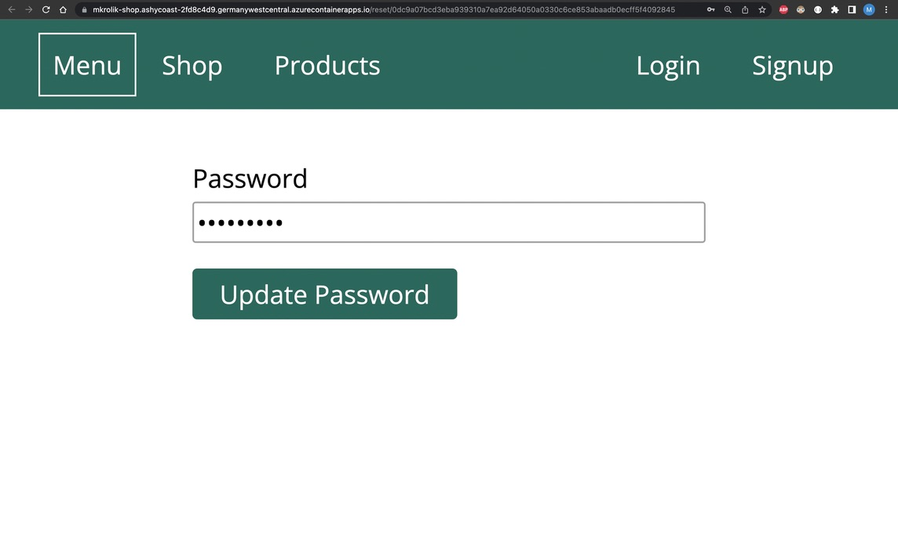
  </a>
  <a href="">
    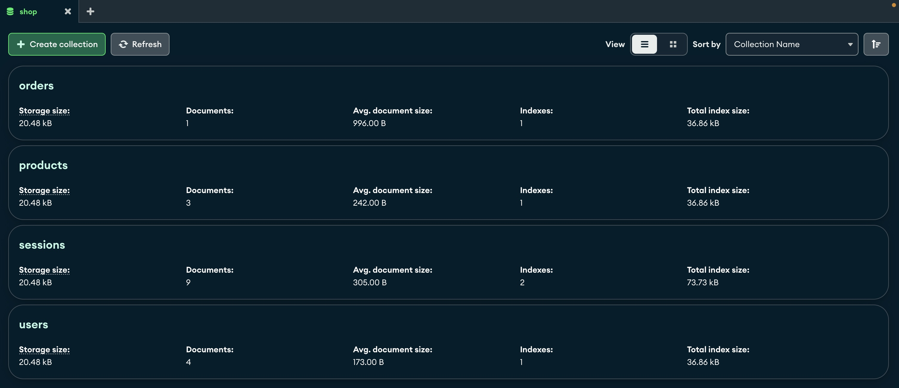
  </a>  
</div>

<p align="right">(<a href="#readme-top">back to top</a>)</p>

<!-- ROADMAP -->

## Roadmap

-   [x] MiddleWare based Node.js Framework (Express)
-   [x] Dynamic Content (EJS Templating Engine)
-   [x] Monolithic Architecture: Model-View-Controller
-   [x] Dynamic routing
-   [x] Hosted NoSQL Database (MongoDB Atlas)
-   [x] Create-Read-Update-Delete Functionality
-   [x] Object Document Mapper (Mongoose)
-   [x] Sessions and Cookies
-   [x] Authentication and Authorization
    -   [x] Password Encryption (Bcrypt)
    -   [x] Cross-Site-Resource-Forgery Tokens
    -   [x] Password Updates
-   [x] Validation (Express-Validator)
-   [x] Error Handling
-   [x] File upload and Download (Azure Blob Storage, PDFKit)
-   [x] Pagination
-   [x] Asynchronous Requests
-   [x] Payments (Stripe)
-   [x] Mobile Responsiveness (Media Query CSS3)

See the [open issues](https://github.com/MateuszKrolik/EXPRESS-SHOP/issues) for a full list of proposed features (and known issues).

<p align="right">(<a href="#readme-top">back to top</a>)</p>

<!-- CONTRIBUTING -->

## Contributing

Contributions are what make the open source community such an amazing place to learn, inspire, and create. Any contributions you make are **greatly appreciated**.

If you have a suggestion that would make this better, please fork the repo and create a pull request. You can also simply open an issue with the tag "enhancement".
Don't forget to give the project a star! Thanks again!

1. Fork the Project
2. Create your Feature Branch (`git checkout -b feature/AmazingFeature`)
3. Commit your Changes (`git commit -m 'Add some AmazingFeature'`)
4. Push to the Branch (`git push origin feature/AmazingFeature`)
5. Open a Pull Request

<p align="right">(<a href="#readme-top">back to top</a>)</p>

<!-- LICENSE -->

## License

Distributed under the MIT License. See `LICENSE` for more information.

<p align="right">(<a href="#readme-top">back to top</a>)</p>

<!-- CONTACT -->

## Contact

Mateusz Królik - [Mateusz Królik](https://www.linkedin.com/in/mateusz-kr%C3%B3lik-8b1862262/) - [mateuszkrolik87@gmail.com](mailto:mateuszkrolik7@gmail.com)

Project Link: [Project Link](https://mkrolik-shop.ashycoast-2fd8c4d9.germanywestcentral.azurecontainerapps.io/)

GitHub Repository Link: [GitHub Repository Link](https://github.com/MateuszKrolik/EXPRESS-SHOP)

DockerHub Image Link: [DockerHub Image Link](https://hub.docker.com/repository/docker/mateuszkrolik/shop/general)

<p align="right">(<a href="#readme-top">back to top</a>)</p>

<!-- ACKNOWLEDGMENTS -->

## Acknowledgments

-   [Img Shields](https://shields.io)
-   [GitHub Emoji Cheat Sheet](https://www.webpagefx.com/tools/emoji-cheat-sheet)
-   [Malven's Flexbox Cheatsheet](https://flexbox.malven.co/)
-   [Malven's Grid Cheatsheet](https://grid.malven.co/)
-   [SVG Repo](https://www.svgrepo.com/)

<p align="right">(<a href="#readme-top">back to top</a>)</p>

<!-- MARKDOWN LINKS & IMAGES -->
<!-- https://www.markdownguide.org/basic-syntax/#reference-style-links -->

[contributors-shield]: https://img.shields.io/github/contributors/MateuszKrolik/EXPRESS-SHOP.svg?style=for-the-badge
[contributors-url]: https://github.com/MateuszKrolik/EXPRESS-SHOP/graphs/contributors
[forks-shield]: https://img.shields.io/github/forks/MateuszKrolik/EXPRESS-SHOP.svg?style=for-the-badge
[forks-url]: https://github.com/MateuszKrolik/EXPRESS-SHOP/network/members
[stars-shield]: https://img.shields.io/github/stars/MateuszKrolik/EXPRESS-SHOP.svg?style=for-the-badge
[stars-url]: https://github.com/MateuszKrolik/EXPRESS-SHOP/stargazers
[issues-shield]: https://img.shields.io/github/issues/MateuszKrolik/EXPRESS-SHOP.svg?style=for-the-badge
[issues-url]: https://github.com/MateuszKrolik/EXPRESS-SHOP/issues
[license-shield]: https://img.shields.io/github/license/MateuszKrolik/EXPRESS-SHOP.svg?style=for-the-badge
[license-url]: https://github.com/MateuszKrolik/EXPRESS-SHOP/blob/master/LICENSE
[linkedin-shield]: https://img.shields.io/badge/-LinkedIn-black.svg?style=for-the-badge&logo=linkedin&colorB=555
[linkedin-url]: https://linkedin.com/in/mateusz-królik-8b1862262
[product-screenshot]: images/screenshot.png
[Express.js]: https://img.shields.io/badge/Express.js-404D59?style=for-the-badge&logo=express
[Express-url]: https://expressjs.com/
[MongoDB]: https://img.shields.io/badge/MongoDB-4EA94B?style=for-the-badge&logo=mongodb&logoColor=white
[MongoDB-url]: https://www.mongodb.com/
[Mongoose]: https://img.shields.io/badge/Mongoose-880000?style=for-the-badge&logo=mongoose&logoColor=white
[Mongoose-url]: https://mongoosejs.com/
[EJS]: https://img.shields.io/badge/EJS-8300C5?style=for-the-badge&logo=ejs&logoColor=white
[EJS-url]: https://ejs.co/
[Docker]: https://img.shields.io/badge/Docker-2CA5E0?style=for-the-badge&logo=docker&logoColor=white
[Docker-url]: https://www.docker.com/
[Linux/Unix]: https://img.shields.io/badge/Linux-FCC624?style=for-the-badge&logo=linux&logoColor=black
[Linux/Unix-url]: https://www.linux.org/
[Node.js]: https://img.shields.io/badge/Node.js-43853D?style=for-the-badge&logo=node.js&logoColor=white
[Node-url]: https://nodejs.org/
[JavaScript]: https://img.shields.io/badge/JavaScript-F7DF1E?style=for-the-badge&logo=javascript&logoColor=black
[JavaScript-url]: https://www.javascript.com/
[NPM]: https://img.shields.io/badge/npm-CB3837?style=for-the-badge&logo=npm&logoColor=white
[NPM-url]: https://www.npmjs.com/
[Microsoft Azure]: https://img.shields.io/badge/Microsoft_Azure-0089D6?style=for-the-badge&logo=microsoft-azure&logoColor=white
[Azure-url]: https://azure.microsoft.com/
[Azure Blob Storage]: https://img.shields.io/badge/Azure_Blob_Storage-0089D6?style=for-the-badge&logo=microsoft-azure&logoColor=white
[AzureBlob-url]: https://azure.microsoft.com/en-us/services/storage/blobs/
[Azure Container Apps]: https://img.shields.io/badge/Azure_Container_Apps-0089D6?style=for-the-badge&logo=microsoft-azure&logoColor=white
[AzureContainerApps-url]: https://azure.microsoft.com/en-us/services/container-apps/
[Stripe]: https://img.shields.io/badge/Stripe-008CDD?style=for-the-badge&logo=stripe&logoColor=white
[Stripe-url]: https://stripe.com/
[PostMark]: https://img.shields.io/badge/PostMark-FF3366?style=for-the-badge&logo=gmail&logoColor=white
[PostMark-url]: https://postmarkapp.com/
[HTML5]: https://img.shields.io/badge/HTML5-E34F26?style=for-the-badge&logo=html5&logoColor=white
[HTML5-url]: https://www.w3.org/html/
[CSS3]: https://img.shields.io/badge/CSS3-1572B6?style=for-the-badge&logo=css3&logoColor=white
[CSS3-url]: https://www.w3.org/Style/CSS/Overview.en.html
